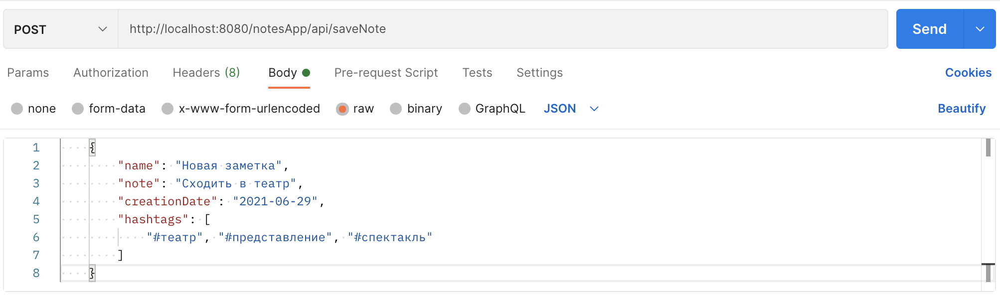

# NotesApp
Notes App REST App

### REST веб-сервис с CRUD-операциями для заметок

### API
* [Запросы](#запросы)
* [Как отправлять запросы](#как-отправлять-запросы)
* [Информация](#информация)


### Запросы
* Просмотр список всех заметок

Пример результата:
```
[
    {
        "id": 1,
        "name": "Заметка # 1",
        "note": "Это тестовая заметка # 1.",
        "creationDate": "2021-06-26",
        "hashtags": [
            "#note",
            "#важно",
            "#заметка"
        ]
    },
    {
        "id": 2,
        "name": "Лист покупок в магазине",
        "note": "Купить: 1) яйца 2) творог 3) хлеб 4) печенье 5) молоко 6) курица",
        "creationDate": "2021-06-24",
        "hashtags": [
            "#note",
            "#купить",
            "#магазин",
            "#продукты"
        ]
    },
    {
        "id": 3,
        "name": "Встреча",
        "note": "Через неделю в 15:00 важная встреча по работе",
        "creationDate": "2021-06-21",
        "hashtags": [
            "#важно",
            "#заметка",
            "#работа"
        ]
    },
    {
        "id": 4,
        "name": "NO HASHTAG",
        "note": "Заметка без хэштегов",
        "creationDate": "2021-06-26",
        "hashtags": []
    }
]
```
* Просмотр списка заметок с указанной датой

Пример результата:
```
[
    {
        "id": 1,
        "name": "Заметка # 1",
        "note": "Это тестовая заметка # 1.",
        "creationDate": "2021-06-26",
        "hashtags": [
            "#note",
            "#важно",
            "#заметка"
        ]
    },
    {
        "id": 4,
        "name": "NO HASHTAG",
        "note": "Заметка без хэштегов",
        "creationDate": "2021-06-26",
        "hashtags": []
    }
]
```
* Получение списка заметок по хэштегу

Пример результата:
```
[
    {
        "id": 1,
        "name": "Заметка # 1",
        "note": "Это тестовая заметка # 1.",
        "creationDate": "2021-06-26",
        "hashtags": [
            "#важно"
        ]
    },
    {
        "id": 3,
        "name": "Встреча",
        "note": "Через неделю в 15:00 важная встреча по работе",
        "creationDate": "2021-06-21",
        "hashtags": [
            "#важно"
        ]
    }
]
```
* Поиск заметок по подстроке

Пример результата:
```
[
    {
        "id": 1,
        "name": "Заметка # 1",
        "note": "Это тестовая заметка # 1.",
        "creationDate": "2021-06-26",
        "hashtags": [
            "#note",
            "#заметка",
            "#важно"
        ]
    },
    {
        "id": 4,
        "name": "NO HASHTAG",
        "note": "Заметка без хэштегов",
        "creationDate": "2021-06-26",
        "hashtags": []
    }
]
```
* Удаление заметки по идентификатору.

Пример результата:
```
{
    "Result": "Success"
}
```
* Обновление заметки

Пример результата:
```
{
    "Result": "Success"
}
```
* Сохранение заметки

Пример результата:
```
{
    "Result": "Success"
}
```

### Информация
В application.properties находятся параметры подключения к бд.  
Их необходимо настроить под свою субд.  

По-умолчанию каждый раз при запуске приложения выполняются sql скрипты  
schema.sql для создания таблиц и data.sql для наполнения данными.  
Таким образом, при каждом запуске приложения будут пересоздаваться таблицы.  
Чтобы этого избежать, необходимо в файле application.properties изменить следующее property:  
`spring.sql.init.enabled=true` на `spring.sql.init.enabled=false`  
Тогда можно вручную выполнить эти скрипты один раз.  

### Как отправлять запросы
* Для GET-запросов достаточно адресной строки браузера

* Для запросов с телом сообщения можно воспользоваться:
     * [Postman](https://www.postman.com)
     * [Swagger](https://swagger.io)

